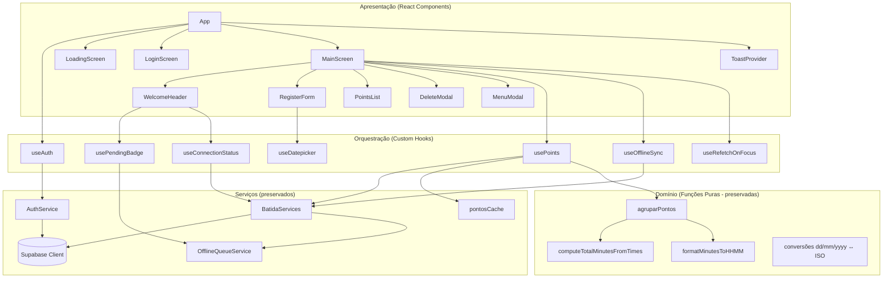
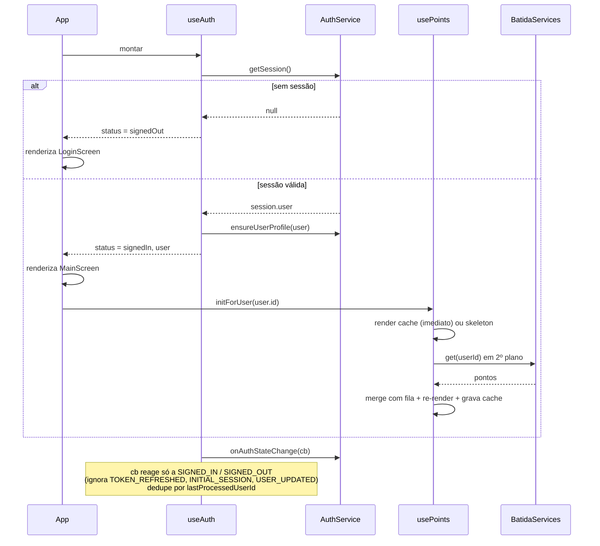
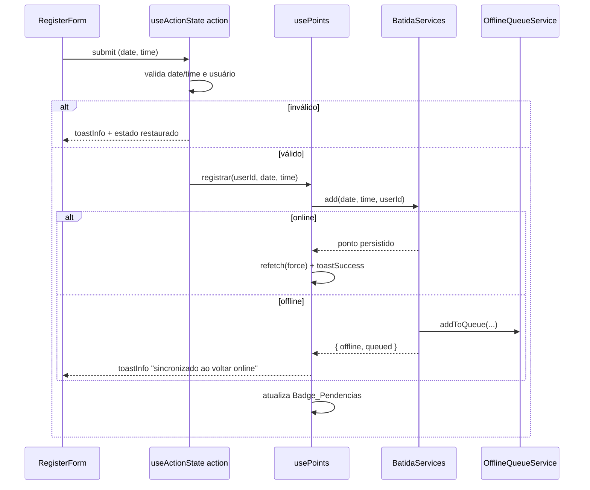
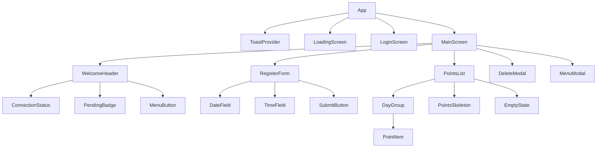

# Design Document

## Overview

Este documento descreve o desenho técnico da migração do PWA de Ponto Eletrônico de uma arquitetura em Vanilla TypeScript (controllers + manipulação direta de DOM) para React 19.2, preservando 100% do comportamento observável pelo usuário final.

A estratégia central é **preservar a camada de serviços praticamente intacta** (`AuthService`, `BatidaServices`, `OfflineQueueService`, `pontosCache`) por serem agnósticas de framework, e **reescrever apenas as camadas de apresentação e orquestração** (controllers, `dom.ts`, `modals`, `ui/screens`, renderizadores baseados em `innerHTML`) como componentes e hooks React. As funções puras de domínio (`agruparPontos`, `computeTotalMinutesFromTimes`, `formatMinutesToHHMM` e as conversões de data/hora) também são preservadas e passam a ser consumidas diretamente durante a renderização declarativa.

Princípios que guiam o desenho:

- **Paridade funcional primeiro**: nenhuma mudança de comportamento, formatos de dados (`dd/mm/yyyy`, `HH:mm`), mensagens em pt-BR ou estrutura da `Fila_Offline` em `localStorage`.
- **Substituir orquestração imperativa por estado declarativo**: as três telas (`Tela_Carregamento`, `Tela_Login`, `Tela_Principal`) passam a ser derivadas de estado, não de alternância manual de classes CSS.
- **Adotar recursos do React 19.2 onde agregam valor**: `useActionState` + `useFormStatus` no formulário de registro, `useOptimistic` na exclusão, `use()`/`Suspense` na verificação de sessão, `ref` como prop no wrapper do datepicker, React Compiler para memoização automática e Document Metadata para o `<title>`.
- **Manter o Ambiente_Build**: Vite 8, TailwindCSS v4, `vite-plugin-pwa` e Biome permanecem; apenas adiciona-se o toolchain React.

### Resultado da pesquisa (React Compiler + Vite 8)

- O React Compiler atingiu **v1.0 estável em outubro de 2025** e opera por padrão sem configuração, memoizando componentes e valores automaticamente ([React Compiler v1.0](https://react.dev/blog/2025/04/21/react-compiler-rc)). Conteúdo reescrito para conformidade de licenciamento.
- O React Compiler roda como **plugin Babel** (`babel-plugin-react-compiler`) e precisa executar **primeiro no pipeline** para analisar o código-fonte original ([Installation – React](https://react.dev/learn/react-compiler/installation)). Há também o **plugin ESLint** (`eslint-plugin-react-hooks` com as regras do compiler) para validação.
- Ponto de atenção do Vite 8: as versões recentes de `@vitejs/plugin-react` (v6+, alinhadas ao Rolldown/Vite 8) **removeram o Babel por padrão**; para rodar ferramentas baseadas em Babel como o React Compiler é preciso habilitá-lo explicitamente ([The Right Way to Install After @vitejs/plugin-react v6](https://recca0120.hashnode.dev/react-compiler-vite-v6)). Conteúdo reescrito para conformidade de licenciamento. O desenho abaixo trata dessa configuração explicitamente.
- React 19.2 consolida `useActionState`, `useOptimistic`, `useFormStatus`, `use()` e melhorias de Suspense, além de `<Activity />` e `useEffectEvent` ([React 19.2](https://react.dev/blog/2025/10/01/react-19-2)).

## Architecture

### Visão geral em camadas

A arquitetura mantém a separação entre apresentação, orquestração, domínio e serviços, mas troca a orquestração imperativa (controllers) por **hooks React** e a apresentação (DOM manual) por **componentes React**.



### Ponto de entrada

- `index.html` deixa de conter markup das telas. Passa a expor apenas `<div id="root"></div>` e o `<script type="module" src="/src/main.tsx">`. As tags de `preconnect`/fontes do Google e o gtag permanecem no `<head>`; o `<title>` passa a ser gerenciado por Document Metadata dentro do `App`.
- `src/main.tsx` cria a raiz com `createRoot(document.getElementById('root')!).render(<StrictMode><App /></StrictMode>)`, importa `index.css`, o CSS do datepicker escolhido e registra os estilos do provedor de toasts. Substitui `src/main.ts`.
- O registro do service worker do `vite-plugin-pwa` (`registerType: 'autoUpdate'`) continua automático via `virtual:pwa-register` ou injeção do plugin — sem mudança de comportamento.

### Estratégia de gerenciamento de estado

Estado é **local e derivado**, sem biblioteca externa de estado global (o escopo é pequeno e centrado em um único usuário):

- **Estado de sessão/tela**: `useAuth` expõe `{ status, user }` onde `status ∈ { 'loading', 'signedOut', 'signedIn' }`. O `App` deriva qual tela renderizar a partir de `status` (substitui o toggle manual de classes `hidden`/`flex`).
- **Estado de pontos**: `usePoints` mantém a lista plana de `PontoRaw`, expõe `grupos` (memoizado via `agruparPontos`), `isLoading` (para o skeleton) e ações `refetch`, `registrar`, `excluir`, `excluirTodos`.
- **Estado de conexão**: `useConnectionStatus` mantém `isOnline` sincronizado com os eventos `online`/`offline` do `window`.
- **Estado de pendências**: `usePendingBadge` mantém a contagem de pendências do usuário, revalidada quando a fila muda (após registro/sync).
- **Estado efêmero de UI**: modais controlados por estado booleano/registro-alvo no `MainScreen`; loading de botões via `useFormStatus`/`useActionState`.

O **React Compiler** cuida da memoização automática; hooks e componentes são escritos sem `useMemo`/`useCallback` manuais salvo onde houver necessidade comprovada (ex.: identidade estável de callbacks passados a `addEventListener`).

### Fluxo de dados — inicialização e autenticação



### Fluxo de dados — registro de ponto (online e offline)



## Components and Interfaces

### Árvore de componentes



### Componentes

- **`App`**: raiz. Consome `useAuth` e decide a tela por `status`. Renderiza `ToastProvider` e a metadata do documento (`<title>Ponto Eletrônico</title>`). Instala listeners globais de conexão via `useConnectionStatus`.
  - Props: nenhuma.

- **`LoadingScreen`**: réplica visual do `#loadingScreen` (spinner + "Carregando..."). Sem estado.

- **`LoginScreen`**: réplica do `#loginScreen` (logo, card, botão Google). Recebe a ação de login e o estado de carregamento.
  - Props: `{ onLogin: () => Promise<void>; isSigningIn: boolean }`.
  - Botão usa `useFormStatus`/estado local para exibir spinner e desabilitar durante o OAuth (Req 3.5); em erro, restaura o estado interativo (Req 3.6).

- **`MainScreen`**: layout pós-login. Compõe header, formulário, botão registrar e lista; hospeda os modais controlados por estado.
  - Props: `{ user: SessionUser }`.

- **`WelcomeHeader`**: card de boas-vindas com nome do usuário, `ConnectionStatus`, `MenuButton` e `PendingBadge`.
  - Props: `{ userName: string }` (consome `useConnectionStatus` e `usePendingBadge` internamente ou via props elevadas ao `MainScreen`).

- **`ConnectionStatus`**: exibe "online"/"offline" com as classes atuais.
  - Props: `{ isOnline: boolean }`.

- **`PendingBadge`**: exibe a contagem; oculto quando `count === 0` (Req 7.5, 7.6).
  - Props: `{ count: number }`.

- **`RegisterForm`**: `<form>` com `DateField`, `TimeField` e `SubmitButton`. Usa `useActionState` para a ação de registro e `useFormStatus` para o estado do botão (Req 4.7). Preenche data/hora atuais na montagem (Req 4.2).
  - Props: `{ onRegister: (date: string, time: string) => Promise<RegisterOutcome> }`.

- **`DateField`**: input de data `dd/mm/yyyy` com datepicker em português. Encapsula o widget via `useDatepicker` (ver hooks).
  - Props: `{ value: string; onChange: (v: string) => void }`.

- **`TimeField`**: `<input type="time">` (HH:mm, 24h).
  - Props: `{ value: string; onChange: (v: string) => void }`.

- **`SubmitButton`**: botão "REGISTRAR"; consome `useFormStatus` para spinner e `disabled` durante o pending.

- **`PointsList`**: recebe os grupos e alterna entre `PointsSkeleton` (carregando), `EmptyState` (lista vazia, sem erro — Req 5.5) e a lista de `DayGroup`.
  - Props: `{ grupos: DiaAgrupado[]; isLoading: boolean; onDelete: (record: string) => void }`.

- **`DayGroup`**: cabeçalho com `date - weekday` e total `HH:MM` (com `!` quando `isPlus8h`) e as classes de cor por `data-less8h/plus8h/ok`; corpo com os `PointItem`.
  - Props: `{ dia: DiaAgrupado; onDelete: (record: string) => void }`.

- **`PointItem`**: `•HH:mm` clicável (dispara exclusão) + badge de status (`clock`/`alert-circle`) para pendentes/erro. Substitui o `data-record`/delegação por handler React.
  - Props: `{ date: string; ponto: PontoRaw; onDelete: (record: string) => void }`.

- **`DeleteModal`**: confirmação de exclusão individual sobre `<dialog>`. Usa `useOptimistic` no `PointsList` para remover imediatamente e reverter em falha (Req 6.7, 6.4).
  - Props: `{ open: boolean; record: string | null; onConfirm: () => void; onCancel: () => void }`.

- **`MenuModal`**: modal com "SAIR" e "APAGAR TUDO" (com `confirm()` de segurança, igual ao atual).
  - Props: `{ open: boolean; onSignOut: () => void; onDeleteAll: () => void; onClose: () => void }`.

- **`ToastProvider`**: monta o container da biblioteca de toasts escolhida.

### Hooks (substituem controllers)

- **`useAuth()`** → substitui a orquestração de sessão do `AppController`.
  - Retorna: `{ status: 'loading'|'signedOut'|'signedIn', user: SessionUser | null, signIn: () => Promise<void>, signOut: () => Promise<void> }`.
  - Responsabilidades: `getSession()` inicial, `ensureUserProfile`, assinatura de `onAuthStateChange` reagindo só a `SIGNED_IN`/`SIGNED_OUT`, ignorando `TOKEN_REFRESHED`/`INITIAL_SESSION`/`USER_UPDATED` (Req 3.9), e dedupe por `lastProcessedUserId` (via `useRef`).

- **`usePoints(userId: string | null)`** → substitui `PointsController` + `atualizarTabelaPontos`.
  - Retorna: `{ pontos: PontoRaw[], grupos: DiaAgrupado[], isLoading: boolean, refetch: (opts?: { force?: boolean }) => Promise<void>, registrar: (...) => Promise<RegisterOutcome>, excluir: (record: string) => Promise<boolean>, excluirTodos: () => Promise<boolean> }`.
  - Responsabilidades: render de cache imediato ou skeleton, fetch em 2º plano com throttle de 10s (preservado), merge com a fila offline, gravação de cache, agrupamento via `agruparPontos` (memoizado pelo compiler).

- **`useConnectionStatus()`** → substitui `setupConnectionListeners` + `updateConnectionStatus`.
  - Retorna: `{ isOnline: boolean }`.
  - Responsabilidades: listeners `online`/`offline`, toasts de reconexão/offline (Req 8.2, 8.3), e dispara a sincronização (via callback/efeito) ao voltar online.

- **`useOfflineSync(userId, isOnline)`** → substitui `syncOfflineQueue`.
  - Retorna: `{ sync: () => Promise<void> }`.
  - Responsabilidades: chamar `batidaPontoService.processQueue()`, toasts de sucesso/falha, reagendamento em 30s enquanto houver conexão (Req 7.3, 7.4), refetch e atualização do badge após sync.

- **`usePendingBadge(userId)`** → substitui `updatePendingBadge`.
  - Retorna: `{ count: number, refresh: () => void }` baseado em `offlineQueueService.getPendingCount(userId)`.

- **`useRefetchOnFocus(userId, isOnline, refetch)`** → substitui `setupVisibilityListener`/`refetchOnFocus`.
  - Responsabilidades: em `visibilitychange` visível, com online e usuário, refetch + badge, respeitando throttle de 60s (via `useRef` de timestamp) (Req 9).

- **`useDatepicker(onChange)`** → wrapper do widget de data.
  - Retorna: `ref` (para prop `ref` do input) e mantém o valor sincronizado. Ver decisão de biblioteca em Data Models/Decisões.

### Decisões de bibliotecas

- **Ícones**: `lucide` → **`lucide-react`**. `initLucideIcons()`/`data-lucide` são eliminados; ícones viram componentes (`<Clock/>`, `<AlertCircle/>`, `<Menu/>`, `<LogOut/>`, `<Eraser/>`).
- **Toasts**: `toastify-js` → **`sonner`** (API declarativa `<Toaster/>` + `toast.success/error/info`, leve e sem necessidade de re-init). Wrappers `toastSuccess/toastError/toastInfo` são reescritos preservando mensagens pt-BR e o visual (cores/borda equivalentes via `toastOptions`). `react-toastify` é alternativa equivalente.
- **Datepicker**: manter **`vanillajs-datepicker` encapsulado em `useDatepicker`** (via `ref` como prop do React 19.2), preservando `language: 'pt'` e `format: 'dd/mm/yyyy'` exatamente. Isso minimiza risco de divergência de formato/idioma. Alternativa considerada: `react-datepicker` — rejeitada nesta migração para não alterar o comportamento/estilo já validado do campo de data.

### Configuração do Ambiente_Build

- **Dependências de runtime**: `react@19.2`, `react-dom@19.2`. Remover `lucide`, `toastify-js`; adicionar `lucide-react`, `sonner`.
- **Dev**: `@vitejs/plugin-react` (Babel, para suportar o React Compiler) OU `@vitejs/plugin-react-swc`; `@types/react`, `@types/react-dom`, `babel-plugin-react-compiler`, e regras do compiler no `eslint-plugin-react-hooks` (o Biome permanece para lint/format geral — Req 1.7).
- **`vite.config.ts`**: adicionar o plugin React **antes** de `tailwindcss()` e manter `VitePWA` e o alias `@`. O React Compiler é registrado como plugin Babel do plugin-react:

```ts
react({
  babel: { plugins: [['babel-plugin-react-compiler', { target: '19' }]] },
})
```

  Observação (Vite 8/plugin-react v6+): como o Babel passou a ser opt-in, garantir que o React Compiler seja habilitado explicitamente conforme a versão do plugin adotada; se usar `@vitejs/plugin-react-swc`, habilitar via a opção de compiler do plugin. O `target` acompanha React 19.
- **`tsconfig.json`**: adicionar `"jsx": "react-jsx"` e incluir `"DOM.Iterable"` se necessário; manter `strict`, `moduleResolution: bundler`, `noEmit`. O script `build` (`tsc -b && vite build`) permanece (Req 1.6).
- **`index.html`**: markup das telas removido; `#root` adicionado; `preconnect`/fontes/gtag preservados.
- **TailwindCSS v4**: sem mudança de pipeline; as classes migram 1:1 para `className` nos componentes (Req 1.3, 2.4). Corrige-se o warning atual de `hidden`/`flex` ao eliminar o toggle manual.

## Data Models

Os modelos de dados são **preservados** para garantir compatibilidade com a `Fila_Offline`, o cache e a persistência (Req 12.2, 12.3).

### Tipos de domínio (preservados)

```ts
// OfflineQueueService.ts — ESTRUTURA PRESERVADA (backward compat do localStorage)
type PontoPendente = {
  id: string            // `temp_${Date.now()}_${random}`
  usuario_id: string
  data: string          // dd/mm/yyyy
  hora: string          // HH:mm
  timestamp: number
  status: 'pending' | 'syncing' | 'error'
  errorMessage?: string
  retryCount?: number
}

// agruparPontos.ts
type PontoRaw = {
  date: string          // dd/mm/yyyy
  time: string          // HH:mm
  id?: string
  status?: 'pending' | 'syncing' | 'error'
  usuario_id?: string
}

type TotalDia = { hhmm: string; minutes: number; isLess8h?: boolean; isPlus8h?: boolean; isOk?: boolean }
type DiaAgrupado = { date: string; pontos: PontoRaw[]; total: TotalDia }
```

### Tipos novos (camada React)

```ts
type SessionUser = { id: string; name: string }         // derivado de user_metadata.full_name || email || 'Usuário'
type AuthStatus = 'loading' | 'signedOut' | 'signedIn'
type RegisterOutcome = { ok: boolean; offline: boolean } // dirige o toast (success vs "sincroniza ao voltar online")
```

### Chaves de `localStorage` (preservadas)

- `pending_pontos` — fila offline (`OfflineQueueService`).
- `pontos_${userId}` — cache de pontos (`pontosCache`).
- `pontos_last_fetch` — throttle de fetch (10s).
- `profile_ensured_${userId}` — flag de `ensureUserProfile`.

### Formatos e conversões (preservados)

- Persistência Supabase: `data` em `yyyy-mm-dd`, `hora` em `HH:mm:ss`.
- Exibição/entrada: `dd/mm/yyyy` e `HH:mm`.
- Conversões continuam em `BatidaServices` (add/remove/processQueue) e `formatPontos` (migrada para dentro de `usePoints` ou mantida como utilitário puro reusável).

## Correctness Properties

*Uma propriedade é uma característica ou comportamento que deve ser verdadeiro em todas as execuções válidas de um sistema — essencialmente, uma afirmação formal sobre o que o sistema deve fazer. Propriedades funcionam como a ponte entre especificações legíveis por humanos e garantias de correção verificáveis por máquina.*

As propriedades abaixo focam nas **funções puras de domínio** preservadas — o núcleo com maior variação por entrada e maior risco de regressão na migração: agrupamento por dia, cálculo de totais, formatação, conversões de data/hora e o merge com a fila offline. Componentes de UI, integração com Supabase, PWA e listeners de eventos são cobertos por testes de exemplo/integração (ver Testing Strategy), não por PBT.

### Property 1: Preservação de batidas no agrupamento

*Para toda* lista de `PontoRaw`, o `agruparPontos` deve conter exatamente as mesmas batidas da entrada (nenhuma perdida ou criada): a soma das quantidades de `pontos` por dia é igual ao tamanho da entrada, e cada par `(date, time)` de entrada aparece no grupo correspondente.

**Validates: Requirements 5.1**

### Property 2: Ordenação de dias e horas

*Para toda* lista de `PontoRaw`, no resultado de `agruparPontos` as datas ficam em ordem decrescente (mais recente primeiro) e, dentro de cada dia, as horas ficam em ordem crescente.

**Validates: Requirements 5.1**

### Property 3: Total do dia é a soma dos pares de horários

*Para todo* dia agrupado, `total.minutes` é igual à soma das diferenças de pares consecutivos de horários ordenados (entrada→saída), ignorando um horário final ímpar, e nunca é negativo.

**Validates: Requirements 5.2**

### Property 4: Formatação de minutos em HH:MM

*Para todo* número inteiro não negativo de minutos, `formatMinutesToHHMM` produz uma string `HH:MM` com minutos sempre em `00–59`, horas com ao menos 2 dígitos, tal que `horas*60 + minutos` reconstrói o valor original.

**Validates: Requirements 5.3**

### Property 5: Round-trip de conversão de data dd/mm/yyyy ↔ ISO

*Para toda* data válida, converter de `dd/mm/yyyy` para `yyyy-mm-dd` e de volta produz a data original (round-trip), preservando o dia representado.

**Validates: Requirements 12.2**

### Property 6: Round-trip do record de exclusão

*Para todo* par `(date, time)`, montar o record `"dd/mm/yyyy&HH:mm"` e depois separá-lo reproduz exatamente a mesma data e hora usadas para localizar/excluir o ponto.

**Validates: Requirements 6.2, 12.2**

### Property 7: Merge com a fila offline não duplica nem perde batidas

*Para toda* lista de pontos da API e *toda* fila offline do usuário, o merge resultante não contém duplicatas de `(date, time)`, dá precedência à API em caso de colisão, e todo par `(date, time)` presente em qualquer uma das fontes aparece no resultado.

**Validates: Requirements 5.1, 7.1**

### Property 8: Badge reflete a contagem de pendências do usuário

*Para toda* fila offline, a contagem exibida no `Badge_Pendencias` é igual ao número de pontos pendentes do usuário atual, e o badge fica oculto se, e somente se, essa contagem for zero.

**Validates: Requirements 7.5, 7.6**

### Property 9: Limite de tentativas de sincronização

*Para todo* ponto pendente, após incrementos sucessivos de retry, ao atingir 3 tentativas ele é marcado como erro permanente (`status = 'error'`) e não é reagendado para novas tentativas.

**Validates: Requirements 7.7**

## Error Handling

- **Sessão inicial**: falha em `getSession()` cai para `Tela_Login` (`status = 'signedOut'`), preservando o comportamento do `AppController.processInitialSession` (Req 3.2). Erro em `ensureUserProfile` é logado e não bloqueia a exibição da `Tela_Principal`.
- **Login Google**: erro no `signInWithGoogle` dispara `toastError('Erro ao fazer login com Google')` e restaura o botão ao estado interativo via reset do `useActionState`/estado local (Req 3.6).
- **Registro**: validação de `date`/`time` vazios → `toastInfo('Preencha a data e hora.')` sem persistir (Req 4.4); ausência de usuário → `toastInfo('Faça login para registrar pontos')` (Req 4.5). Falha na persistência → `toastError('Erro ao registrar. Tente novamente.')` (Req 4.9). Sem rede, o `add` enfileira e o hook exibe o toast de sincronização futura (Req 4.10).
- **Listagem/fetch**: se o fetch falhar e não houver cache para segurar a UI, `toastError('Erro de comunicação.')` e lista vazia; havendo cache, mantém-se o cache (modo offline), como hoje.
- **Exclusão individual**: `useOptimistic` remove o item na hora; em falha, o estado é revertido (rollback) e `toastError('Erro ao excluir o registro.')`, seguido de refetch para reconciliar (Req 6.4, 6.7).
- **Apagar tudo**: protegido por `confirm()`; sucesso limpa cache e exibe `toastSuccess`, falha exibe `toastError('Erro ao excluir.')`.
- **Sincronização**: `processQueue` trata duplicatas (código `23505` remove da fila), incrementa retry e, ao exceder 3, marca erro permanente; falhas parciais disparam `toastError` e reagendam em 30s enquanto online (Req 7.4).
- **Erros inesperados de render**: um `ErrorBoundary` na raiz (envolvendo `MainScreen`) evita tela branca, exibindo fallback discreto e permitindo reload — comportamento novo, não regressivo.
- **Ambientes sem `localStorage`**: os serviços já usam `try/catch` na leitura/escrita da fila; esse tratamento é preservado.

## Testing Strategy

### Abordagem dual

- **Testes de propriedade (PBT)** cobrem as funções puras de domínio (Correctness Properties 1–9), onde a variação por entrada revela casos de borda.
- **Testes de exemplo/unidade** cobrem comportamentos concretos, componentes e casos de erro.
- **Testes de integração/smoke** cobrem o que não varia significativamente por entrada: fiação com Supabase, registro do service worker (PWA) e configuração de build.

### Ferramentas

- **Runner**: Vitest (integra nativamente com Vite 8 e o alias `@`).
- **PBT**: `fast-check` (padrão do ecossistema JS/TS). Cada teste de propriedade roda **no mínimo 100 iterações** (`fc.assert(..., { numRuns: 100 })`).
- **Componentes**: React Testing Library + `@testing-library/user-event`; `jsdom` como ambiente.
- **Mocks**: cliente Supabase e `localStorage` mockados para isolar lógica de I/O.

Cada teste de propriedade referencia sua propriedade de design com a tag:

**Feature: react-19-migration, Property {número}: {texto da propriedade}**

### Cobertura por propriedade (PBT)

- Property 1, 2 → `agruparPontos` com listas geradas (datas/horas aleatórias, incluindo dias repetidos e listas vazias).
- Property 3 → `computeTotalMinutesFromTimes` (pares, ímpares, horários iguais, fora de ordem).
- Property 4 → `formatMinutesToHHMM` (0 e inteiros grandes).
- Property 5, 6 → conversões de data e record (round-trip), com datas válidas geradas.
- Property 7 → função de merge (API × fila), garantindo unicidade e precedência.
- Property 8 → contagem/visibilidade do badge a partir de filas geradas por usuário.
- Property 9 → `incrementRetry`/`updateStatus` até o limite de 3.

### Testes de exemplo/unidade (não-PBT)

- `useAuth`: dedupe de `SIGNED_IN`, ignorar `TOKEN_REFRESHED`/`INITIAL_SESSION`/`USER_UPDATED`, transição para `signedOut` em `SIGNED_OUT` (Req 3.7–3.9).
- `RegisterForm`: preenchimento de data/hora atuais na montagem; validações de campos vazios e usuário ausente; estado de loading do botão (Req 4.2, 4.4, 4.5, 4.7).
- `PointsList`: alterna skeleton (carregando), `EmptyState` (vazio, sem erro) e grupos; renderização de badges de status (Req 5.4–5.6).
- `DeleteModal`/`useOptimistic`: remoção otimista e rollback em falha (Req 6.1, 6.4, 6.7).
- `useRefetchOnFocus`: throttle de 60s e no-op offline (Req 9.1–9.3).
- `ConnectionStatus`/`useConnectionStatus`: transições online/offline e toasts (Req 8).
- Wrappers de toast: mensagens pt-BR equivalentes (Req 10, 12.4).

### Testes de integração/smoke

- Build de produção conclui sem erros de tipos (`tsc -b && vite build`) e o React Compiler é aplicado (Req 1.5, 1.6).
- PWA: manifesto/ícones presentes e service worker registrado com `autoUpdate`; runtime caching NetworkFirst do Supabase e fontes do Google preservados (Req 11) — validado via inspeção do `vite build`/`sw` gerado.
- Supabase: 1–3 exemplos representativos de `add`/`get`/`remove` com cliente mockado, verificando as conversões de formato.

### Fora de escopo de PBT (justificativa)

Renderização de UI/Tailwind, comportamento do service worker, OAuth do Google e chamadas ao Supabase não têm propriedades universais úteis do tipo "para todo input X, vale P(X)" — são validados por testes de exemplo, snapshot e integração, conforme acima.
